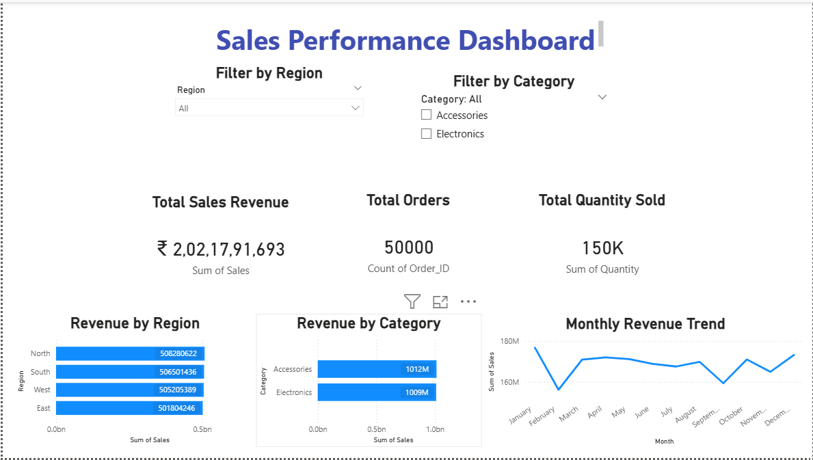
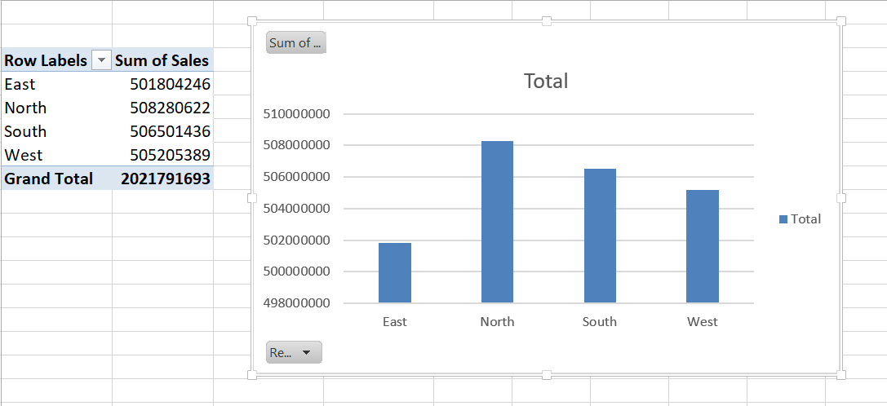
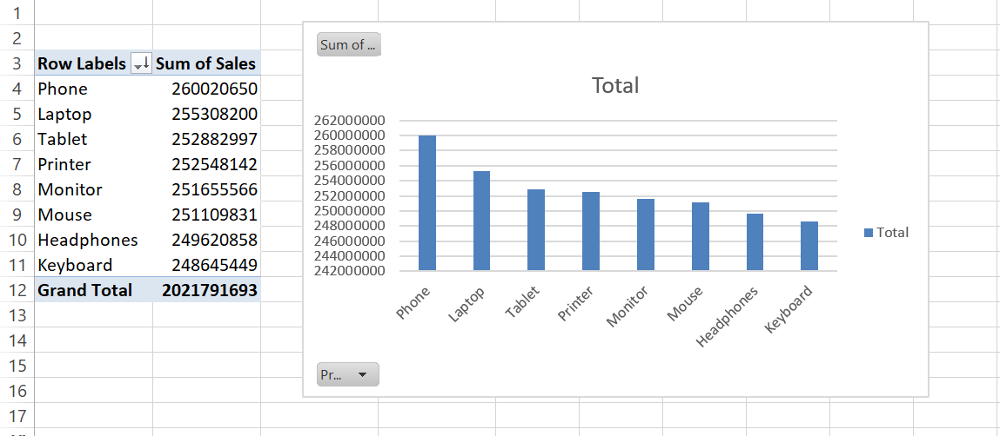
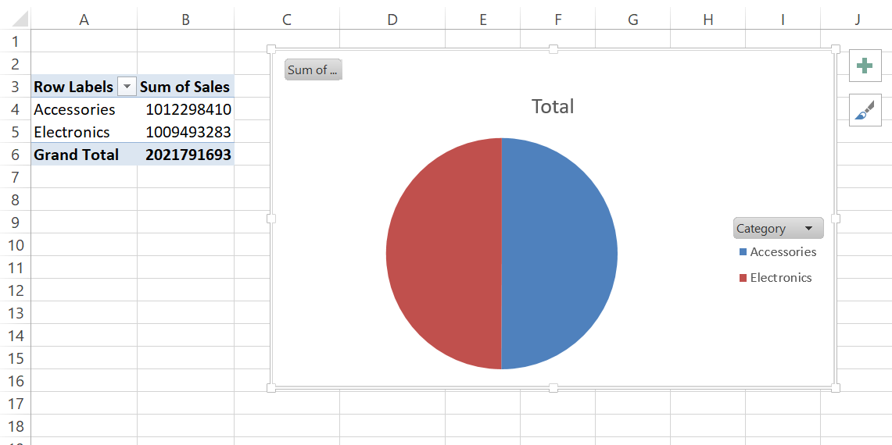

# 📈 Sales Data Analysis Dashboard

## Business Problem

Businesses need to understand sales performance across products, categories, and regions to identify growth opportunities and improve decision-making.

## Project Overview

This project focuses on analyzing sales performance using SQL, Excel, and Power BI. The dashboard highlights revenue trends, top-performing products, and regional sales performance.

## Dataset Description

The dataset includes:

* Sales Records
* Product Information
* Regional Data
* Revenue Details

## Tools Used

* SQL
* Excel
* Power BI

## Project Workflow

1. Data Collection
2. Data Cleaning
3. SQL Query Analysis
4. KPI Generation
5. Dashboard Development
6. Performance Analysis

## Dashboard Preview

### Complete Dashboard

### Sales by Region

### Top Selling Products

### Category Analysis

---

## Key Insights

* Generated insights from 50,000 customer orders and ₹20+ Crore in sales revenue.
* North region contributed the highest share of overall revenue.
* Top-performing products accounted for a significant portion of total sales.
* Category-wise analysis highlighted the strongest revenue-generating segments.
* Monthly trend analysis revealed fluctuations in sales performance across the year.
* Interactive KPI dashboards enabled quick monitoring of business performance.

## Conclusion

This project demonstrates the use of SQL, Excel, and Power BI to analyze sales performance and transform raw data into actionable business insights. Through interactive dashboards and KPI tracking, the project highlights sales trends, top-performing products, and regional performance, helping support data-driven decision-making and business growth.

## Skills Demonstrated

- SQL Querying and Data Analysis
- Power BI Dashboard Development
- Microsoft Excel Data Processing
- Data Cleaning and Transformation
- KPI Tracking and Reporting
- Data Visualization
- Business Intelligence
- Sales Performance Analysis
- Trend Analysis and Insights Generation

---

## Author

Krunal Pramod Patil

GitHub: https://github.com/Krunalpatil15
LinkedIn: http://www.linkedin.com/in/krunal-patil-ab10172b9
